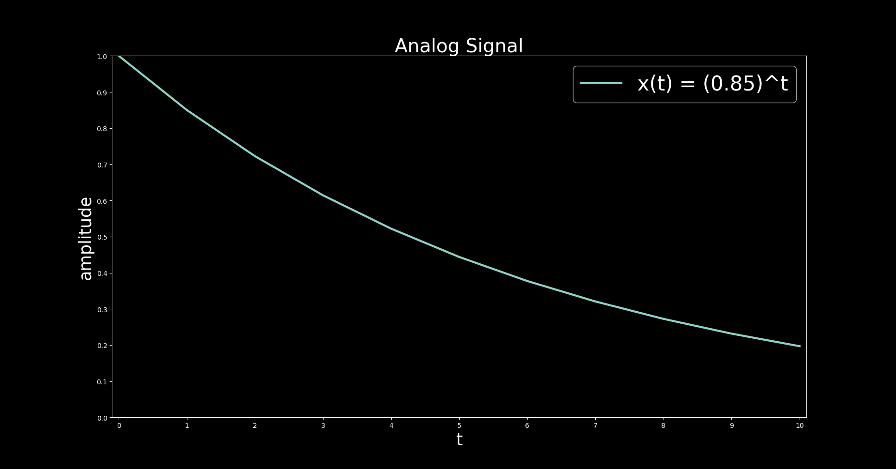
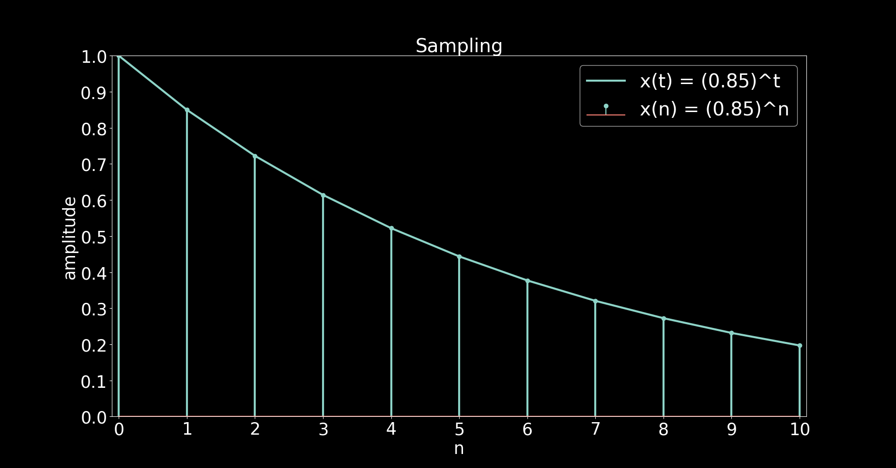
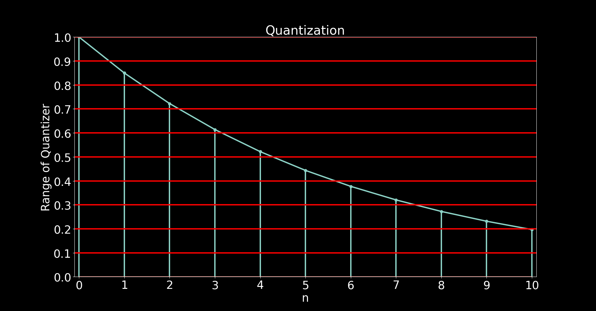
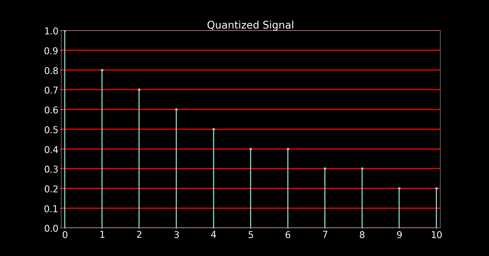

# Analog to Digital Conversion

## Example

Consider the following Analog signal

Our analog signal is given by: $x(t) = (0.85)^t$

**Sampling:**

For sampling, we have to define a sampling interval, T. We define sampling
interval by setting sampling frequency “f,”. For simplicity suppose

$f_s = 1Hz$

$T = \dfrac{1}{f_s}$

$T = 1s$

For sampling replace $t = nT$

Thus,

$x(nT) = (0.85)^{nT}$

Since $T = 1s$, therefore,

$x(n) = (0.85)^n$

$x(n)$ is the discrete time signal with sampling interval of 1s.

**Quantization:**

Quantization is the process of converting the amplitude of discrete signal into
a digital signal by expressing each sample value as a finite (instead of infinite)
number of digits.

Accuracy of the signal representation is directly proportional to how many
discrete levels are allowed to represent the magnitude of the signal.

| Discrete time (n) | Discrete Signal $(0.85)^n$ | Quantized Signal |
| --- | --- | --- |
| 0     | 1                     | 1     |
| 1     | 0.85                  | 0.9   |
| 2     | 0.7224999999999999    | 0.7   |
| 3     | 0.6041249999999999    | 0.6   |
| 4     | 0.5220062499999999    | 0.5   |
| 5     | 0.44370531249999995   | 0.4   |
| 6     | 0.37714951562499993   | 0.4   |
| 7     | 0.3205770882812499    | 0.3   |
| 8     | 0.27249052503906246   | 0.3   |
| 9     | 0.23161694628320306   | 0.2   |
| 10    | 0.1968744043407226    | 0.2   |

**Quantized Signal:**

| $b_3$ | $b_2$ | $b_1$ | $b_0$ | Quantized Levels |
|---|---|---|---|---|
| 0 | 0 | 0 | 0 | 0.0 |
| 0 | 0 | 0 | 1 | 0.1 |
| 0 | 0 | 1 | 0 | 0.2 |
| 0 | 0 | 1 | 1 | 0.3 |
| 0 | 1 | 0 | 0 | 0.4 |
| 0 | 1 | 0 | 1 | 0.5 |
| 0 | 1 | 1 | 0 | 0.6 |
| 0 | 1 | 1 | 1 | 0.7 |
| 1 | 0 | 0 | 0 | 0.8 |
| 1 | 0 | 0 | 1 | 0.9 |
| 1 | 0 | 1 | 0 | 1.0 |

---

[All plot codes](plots.py)
