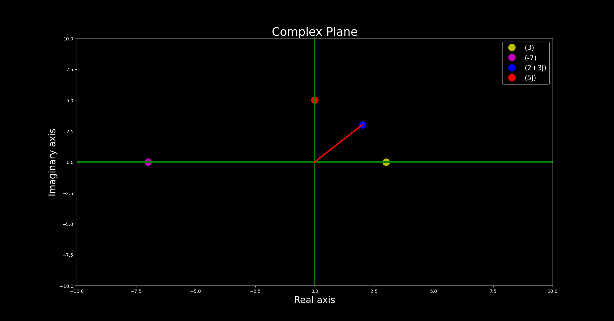
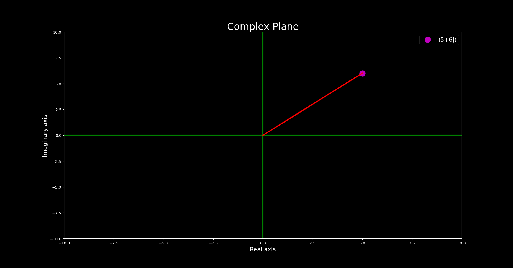
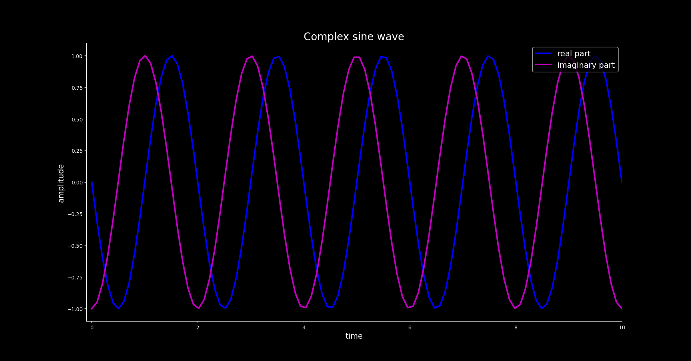

# Complex Numbers

Equation responsible for the existance of complex numbers.

$$ x^2 + 1 = 0 $$

$$ x^2 = -1 $$

$$ x = \sqrt{-1} $$

$$ j = \sqrt{-1} $$

$$ j^2 = -1 $$

Complex Number is the sum of real and imaginary number.

$$z = x +yj$$

## Complex Plane

[Code](complex_plane.py)

## Mathematical Operations on Complex Numbers

[Code](complex_math.py)

## Magnitude and Phase Calculation for Complex Numbers

[Code](complex_mag.py)

## Generation of a complex sine wave

[Code](complex_sine.py)

