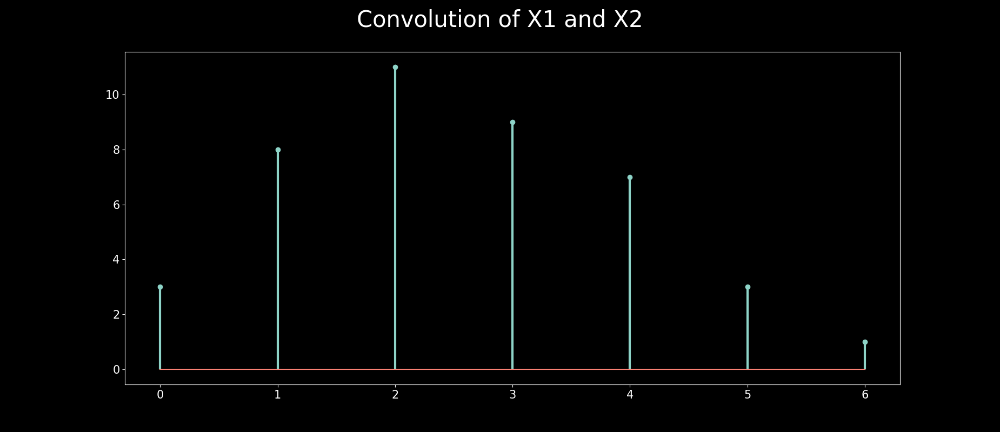
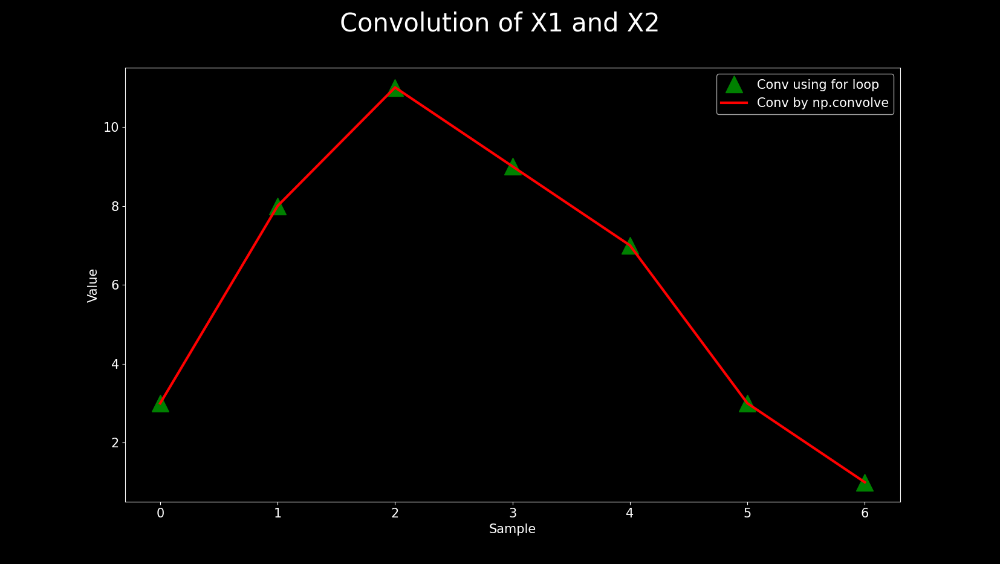
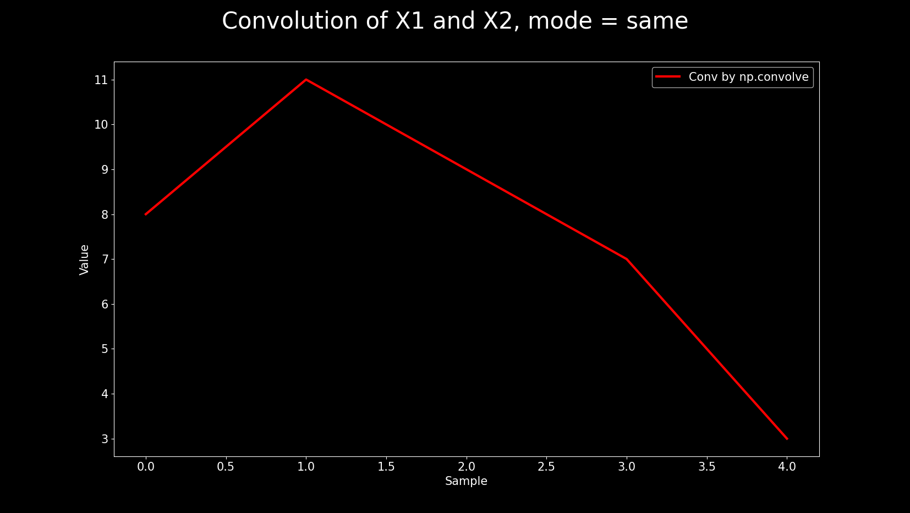
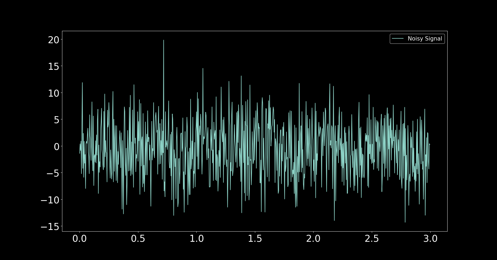
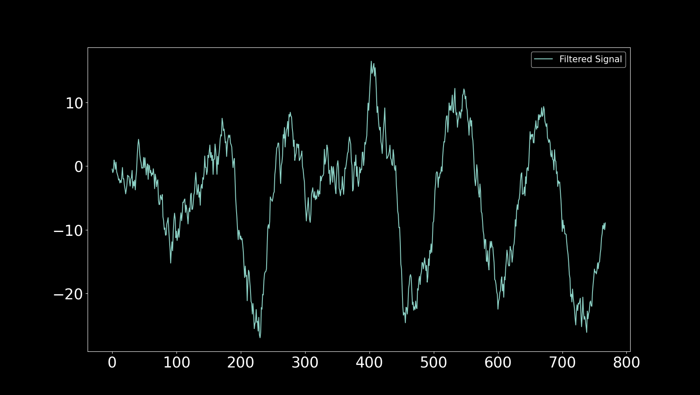
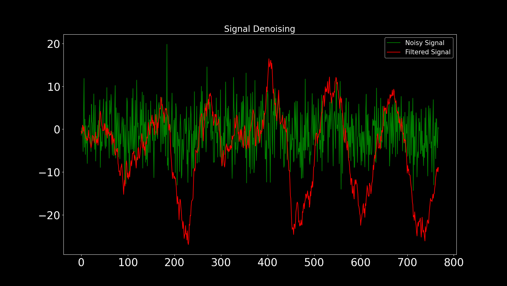
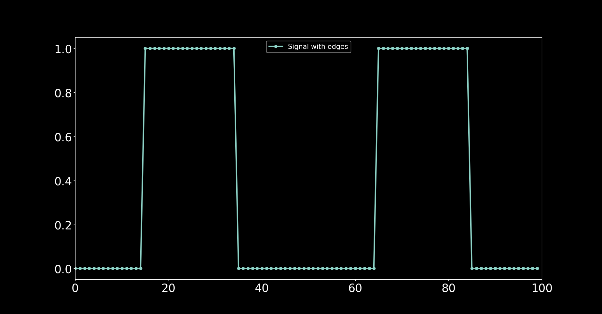
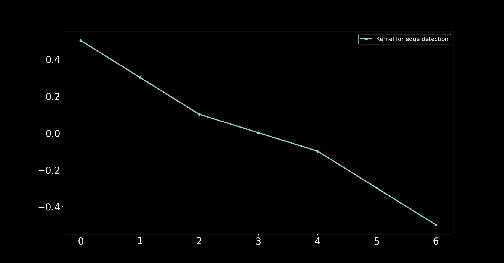
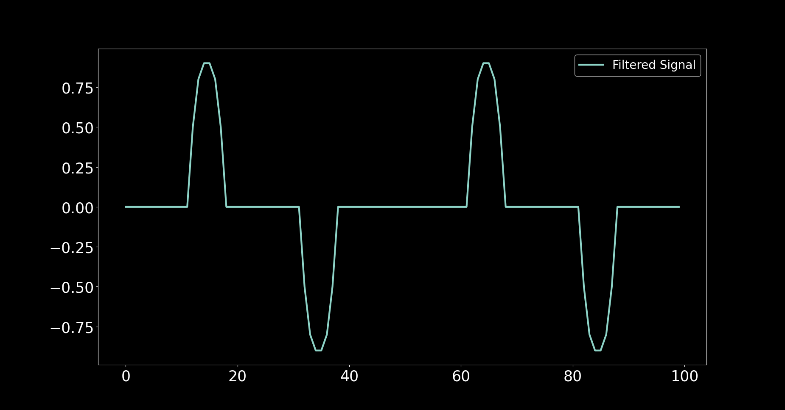
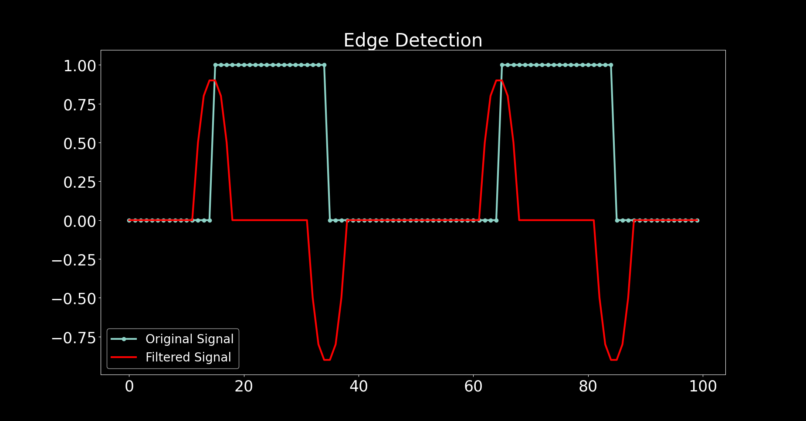

# Convolution

## Representing a discrete time signal

Following are the two commonly used methods for representing a
signal.

1. Sequential method.
2. Graphical method.

## Sequential Representation of discrete time signal

Sequential representation of discrete time signal is shown below

$$x(n) = [2,1,-2,-2,3,2,2,-1,1]$$

## Graphical Representation of discrete time signal

## The Convolution Sum

The response or the convolution sum $y(n)$ of the two input signals $x_1(n)$ and
$x_2(n)$ is defined by the following equation.

$y(n) = x_1(n)  \circledast x_2(n)$

$x_2(n)$ is called kernel or filter.

## Steps for performing convolution sum

1. Flipping/Folding.
2. Shifting.
3. Multiplication.
4. Addition.

$y(n) = x_1(n)  \circledast x_2(n)$

$y(n) = \sum_{k=0}^{N-1} x_1(k)x_2(n-k)$

$x_2(n)$ is called kernel or filter.

## Example

**The output sequence:**

## Convolution for mode = “full"

The number of samples in first signal = $nx_1 = 5$

The number of samples in the kernel = $nx_2 = 3$

Number of samples in output sequence = nconv = $nx_1 + nx_2 - 1 = 5 + 3 - 1 = 7$

### More Examples in Python

**Convolution by for loops:**

**Convolution by np.convolve using mode="full":**

**Convolution by np.convolve using mode="same":**

## Aplications

### Denoising

[Code](denoising.py)

### Edge Detection Using Convolution

[Code](edge.py)

