# Denoising

## Signal Denoising by Moving Average Filter

$$y(n) = \dfrac{1}{M}\sum^{M-1}_{i=0} x(n+1)$$

If we have a five point filter moving on the 10th point then for symmetrically
chosen points.

$$y[10] = \dfrac{y[8]+y[9]+y[10]+y[11+y[12]]}{5}$$

The other possibility is

$$y[10] = \dfrac{y[10]+y[11]+y[12]+y[13+y[14]]}{5}$$

[Code](moving_average.py)

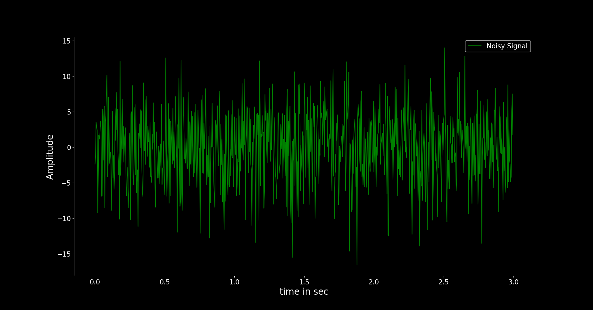

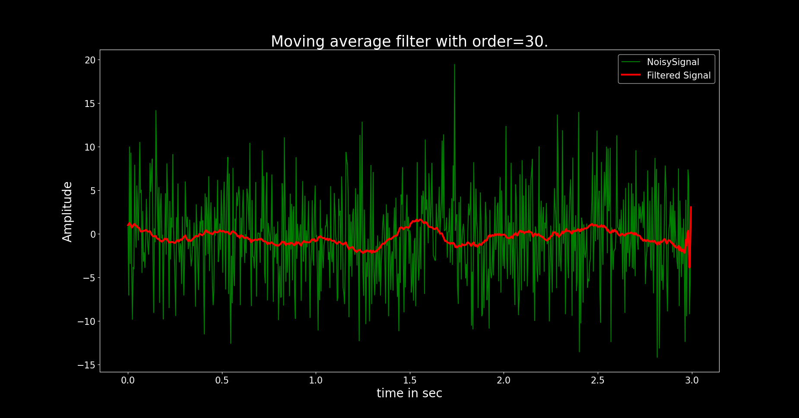

## Gaussian Average or Gaussian Mean Filter

$$ GaussianFilter = e^{\frac{-4ln(2)t^2}{(f\omega h m)^2}} $$

Where $f\omega hm$ is an important parameter of Gaussian and is called full width
half maximum. The spread of the Gaussian depends upon this parameter. It is
approximately 2.4 times the standard deviation.

[Code](gaussian_mean.py)

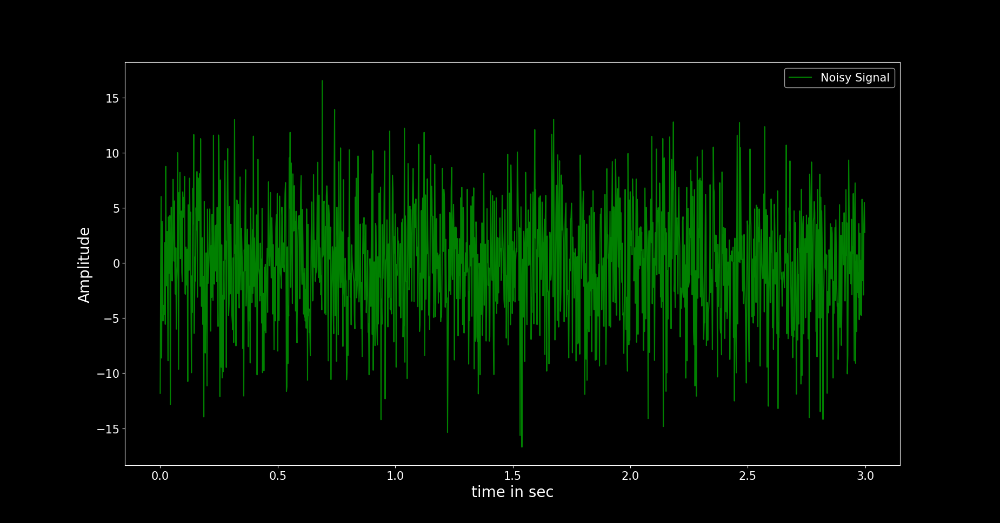

**Gaussian filter/kernel**

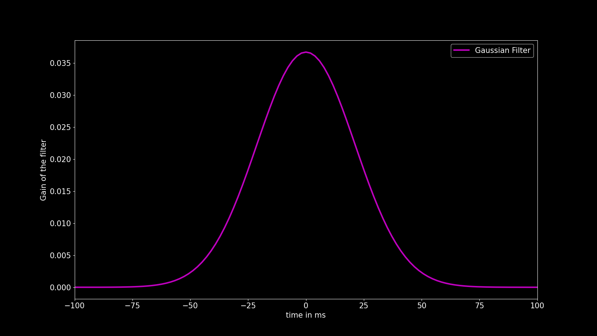

**Zero padding the noisy siganl to avoid edge effect**

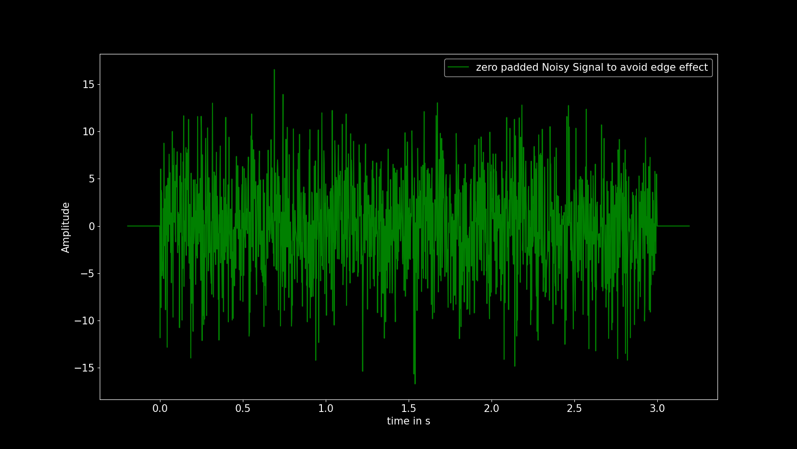

**Filtered signal**

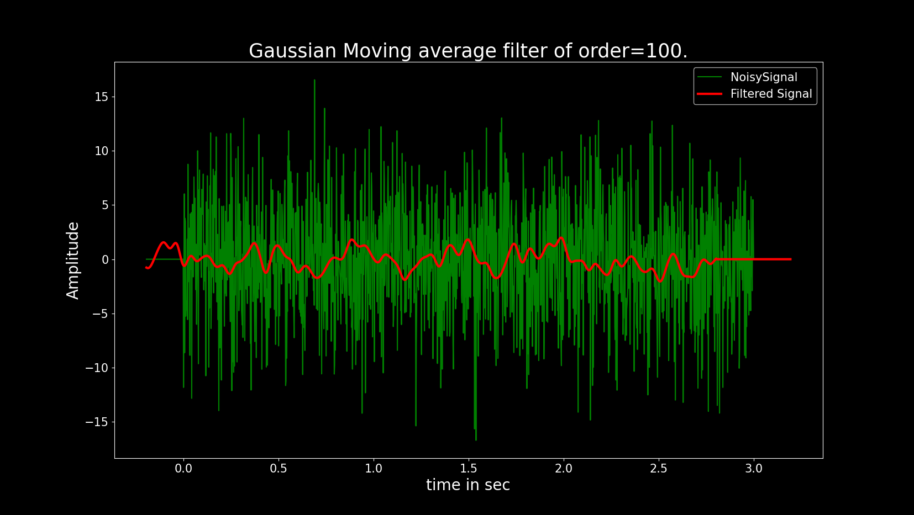

**Clipped filtered signal**

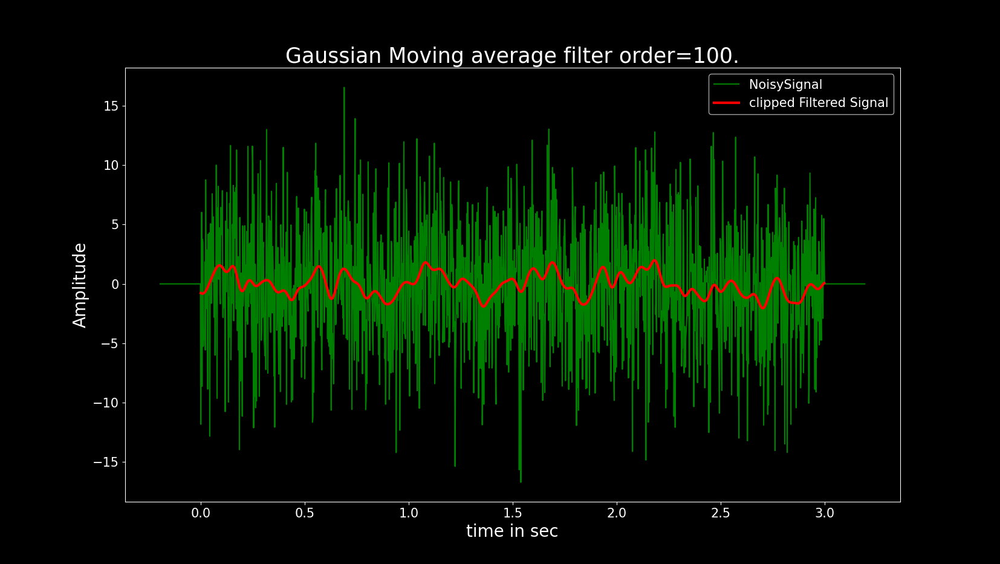

## Median Filter

**Median of the Data**

Consider the following data sequence: 7, 9, 10, 14, 17

The median is the middle value of the data i.e 10.

median = 10.

If the data sequence has even number of elements i.e

7, 9, 10, 14, 17, 19

Then the median is the mean value of the two middle values i.e

median = $\dfrac{10+14}{2} = 12$

If the data sequence is unsorted then we have to sort the data before finding
the median. Consider the following data: 12, 4, 3, 7, 11, 6, 13

After data sorting, we have: 3, 4, 6, 7, 11, 12, 13

Now median is the middle value of the data i.e 7

median = 7

**Median Filter**

Median filter is a nonlinear filter. It works by moving through the noisy signal
and replacing each data point of the noisy signal with median values of the
neighbouring data points.

[code](median.py)

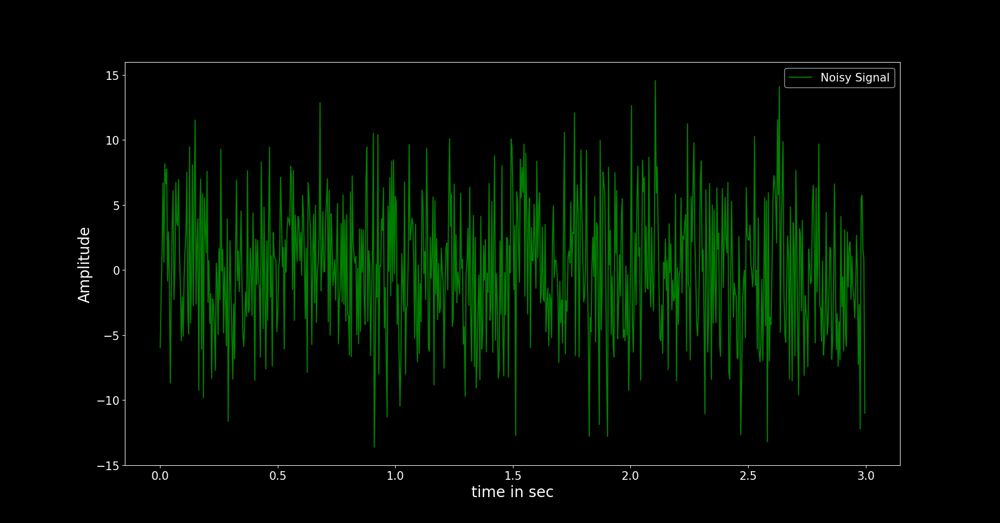

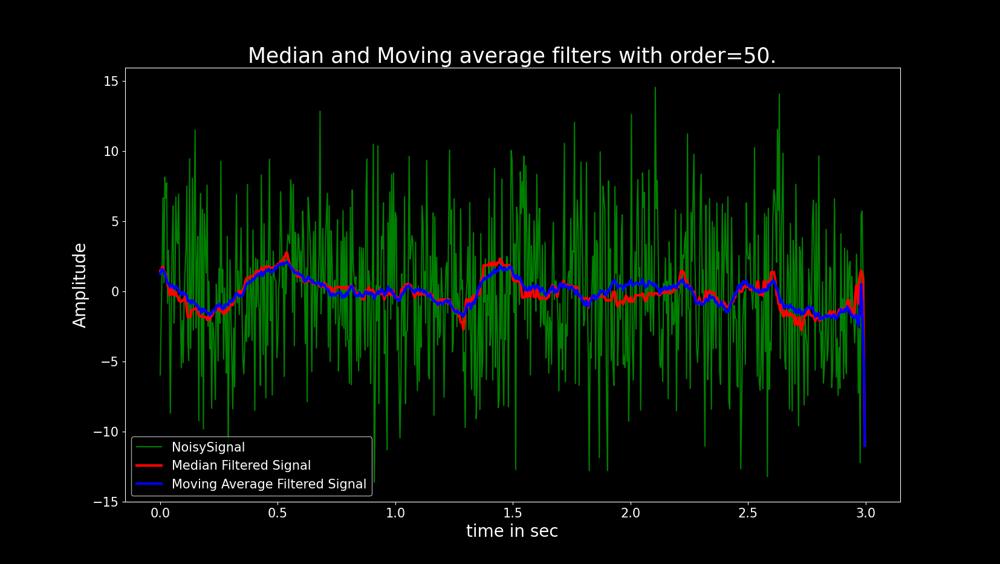

**Spikes With median filter**

[code](spikes.py)

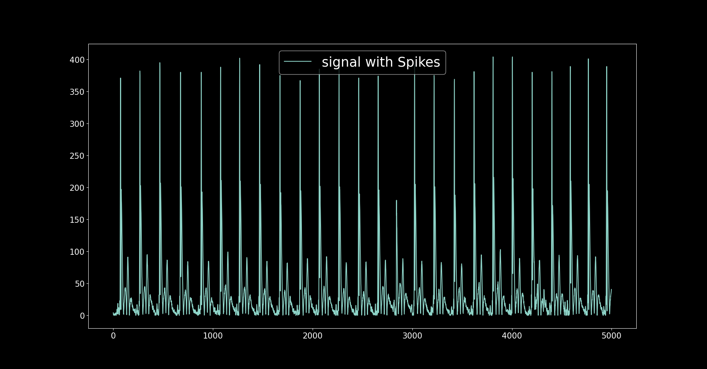

Hist:

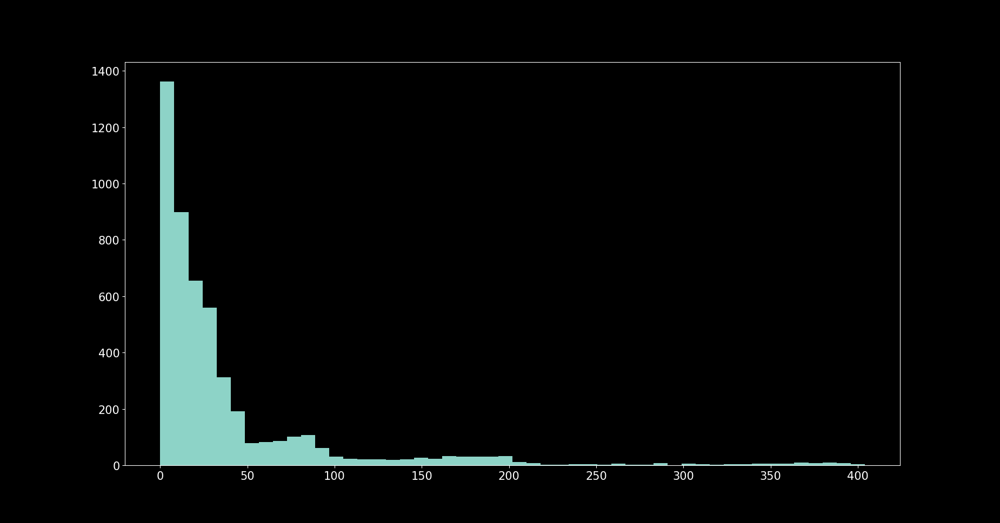

Filtered:

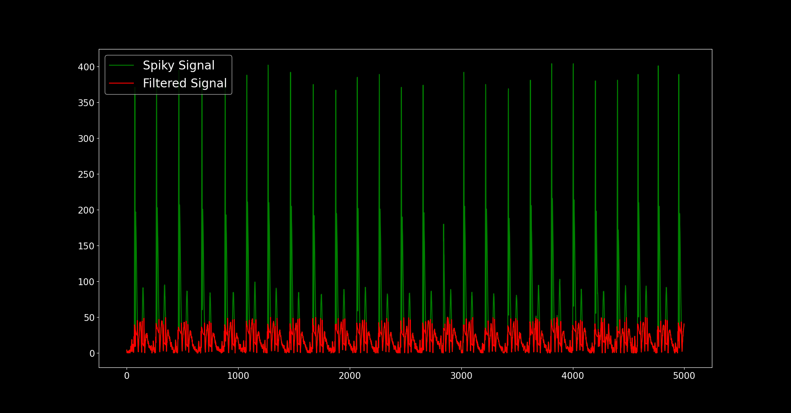