# Fourier Transform

Amongst the several transformations that are used in Engineering and Sciences,
the Fourier transform is probably the most popular one.

The purpose of the Fourier transform is to obtain further information from
the signal that is not readily available in the raw form of the signal.

Most of the signals exists are in “time-domain” in their original or raw form.
It means when we plot the signal then the “time”, which is independent variable,
is on independent axis or X-axis and the other (dependent variable), which most
of the cases is “amplitude” is on dependent axis or Y-axis. So, the plotting of
the time-domain signal gives us the time-amplitude of the signal.

!sinewave

## Concept of Frequency

In various cases the most important information resides in the frequency
contents or in frequency domain of the signal.

We know that if some physical quantity varies rapidly, we say that it has a
high frequency as compare to those quantities which change slowly. For instance,
the publication frequency of a daily published newspaper is higher than that of a
weekly published magazine because the newspaper is published more frequently.

!frequency

## Sine Waves

[Code](sine_wave.py)

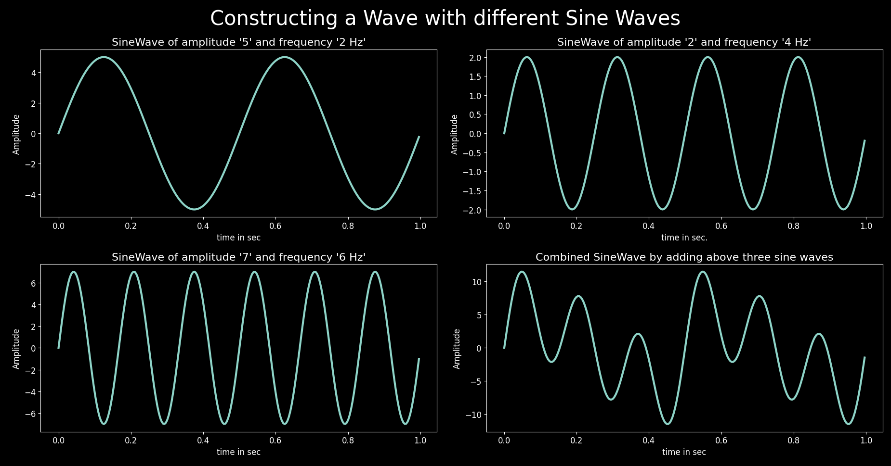

## Cossines Waves

[Code](cosine_wave.py)

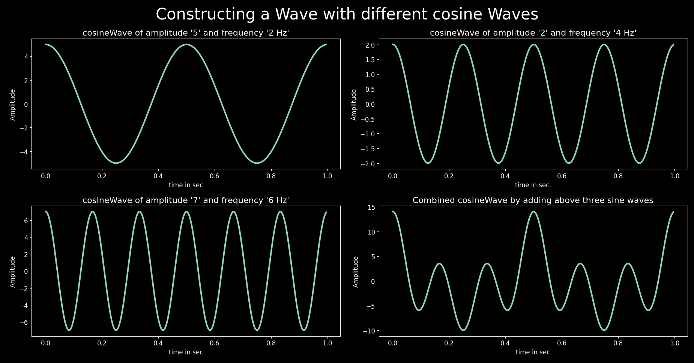

## Sine and Cossine

[Code](sine_cosine.py)

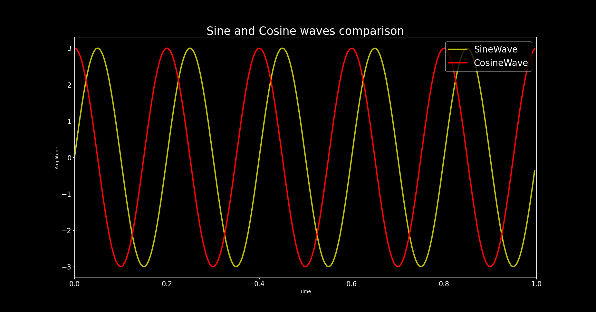

## Sine, Cossine and DC

[Code](sine_cosine.py)

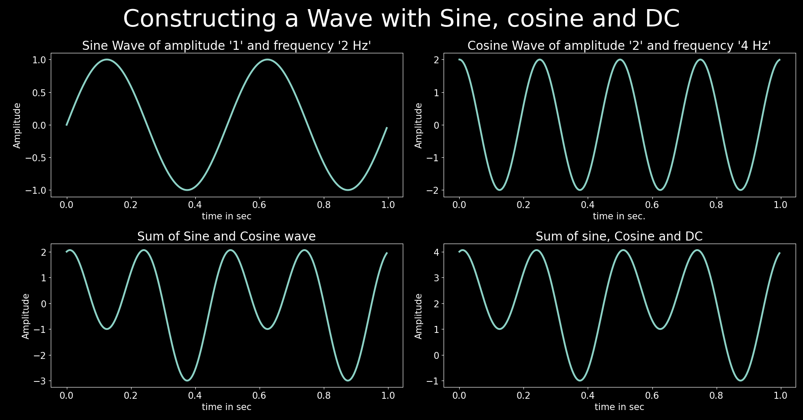

## Signal with frequencies 10, 25, 50 and 100 Hz

[Code](freq_wave.py)

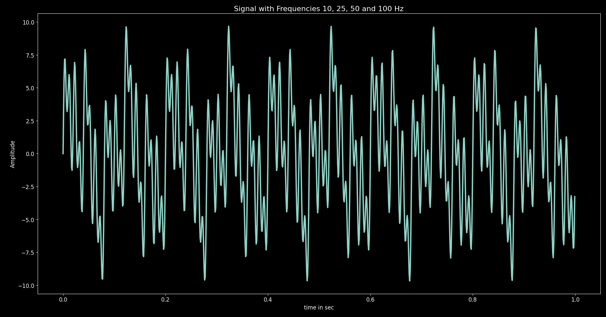

## Procedure of Fourier Transform

Jean Baptiste Fourier, a French physicist, discovered that any periodic waveform
can be decomposed into a sine wave and the combination of sine waves.

The mechanism of Fourier transform is to model the signal with the sine wave.
If our signal has N data points, we select the the sine waves with atleast
N different frequencies and then we find the similarities with the signal
using dot product.

## Step by Step coding for Fourier transform

[Code](fourier_code.py)

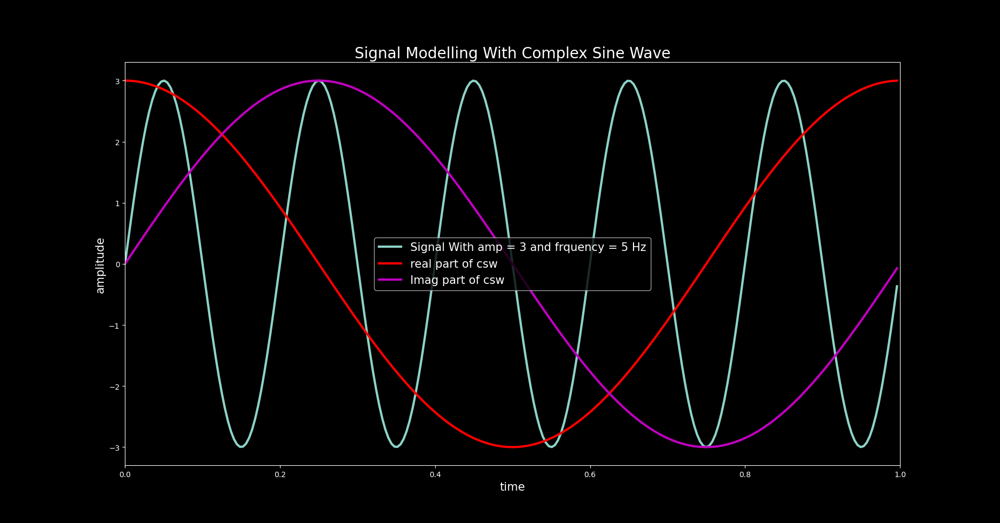

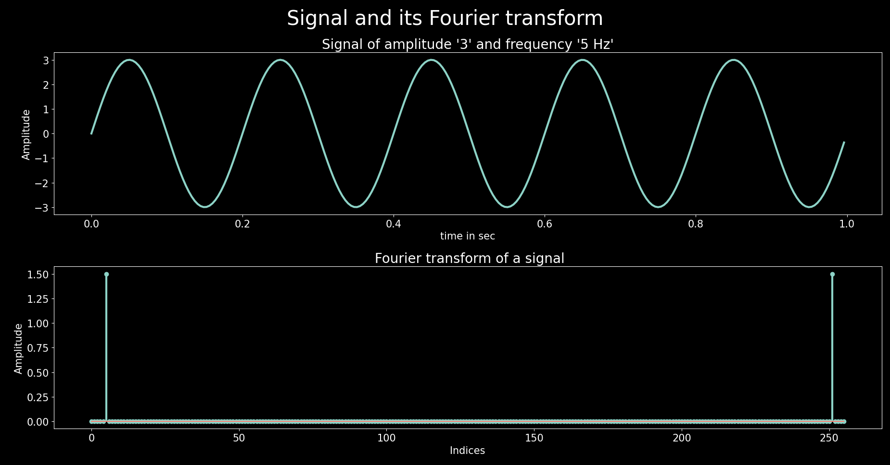

**Fourier Transform of signal with amplitude '3' and frequency '5'**

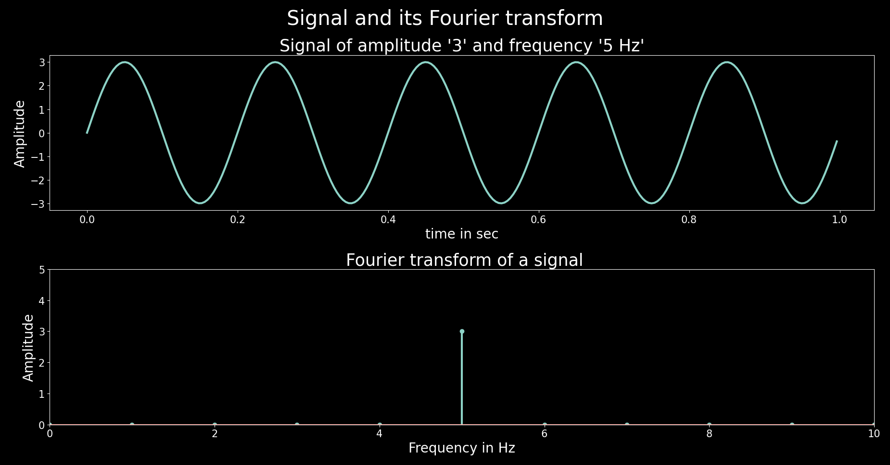

**Fourier transform of a signal with multiple frequencies**

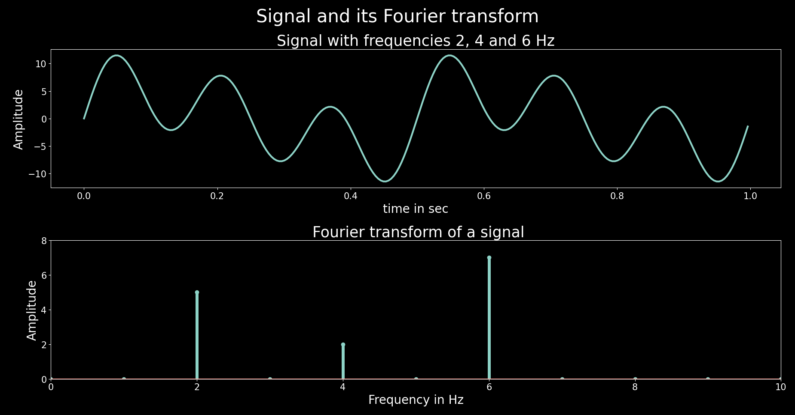

**Fourier transform of a signal with sine, cosine and a DC Component**

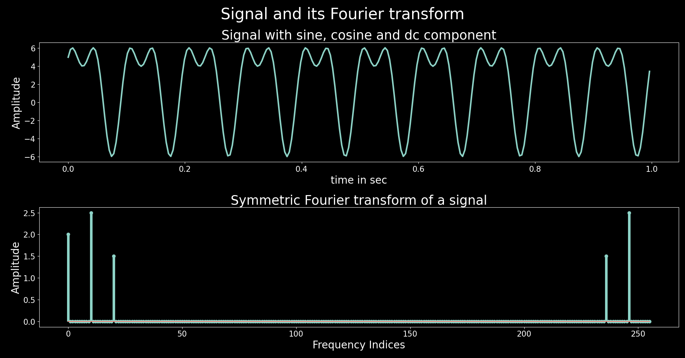

**Amplitude and Power spectrum**

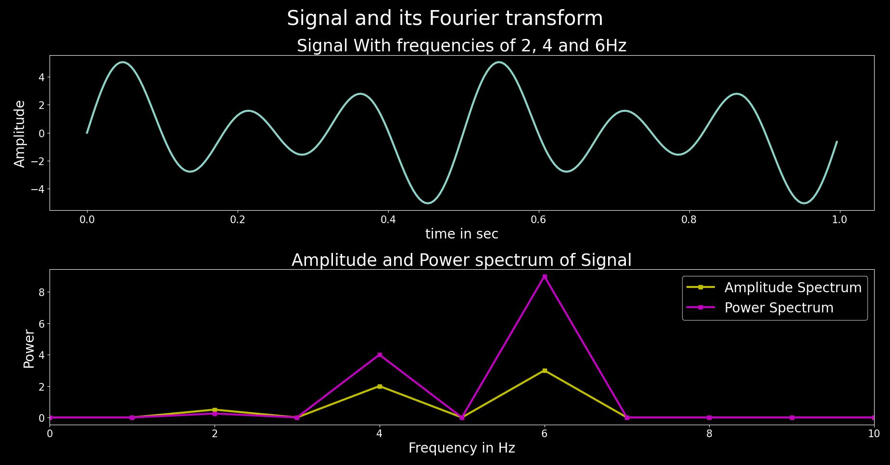

## Inverse Fourier transform

The Inverse Fourier Transform (IFT) is the mathematical process of converting a
signal from the frequency domain (spectrum) back to the time domain,
reconstructing the original signal from its constituent frequencies. It
essentially reverses the Fourier Transform (FT), using an integral to combine
complex sinusoids (based on the frequency components) to rebuild the signal's
waveform over time, with a key difference being a positive exponential term and
a scaling factor (often $\frac{1}{2}\pi$ ) compared to the FT's negative exponential. 

[Code](inverse_fourier.py)

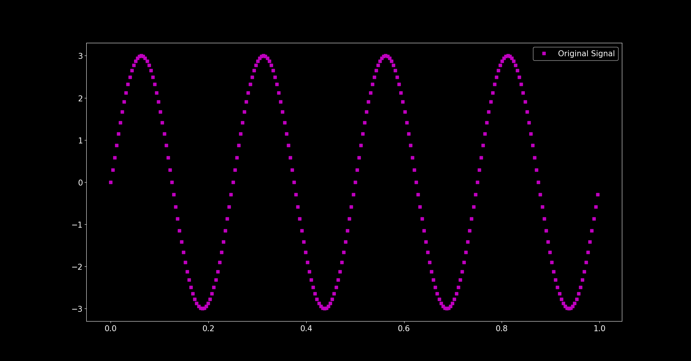

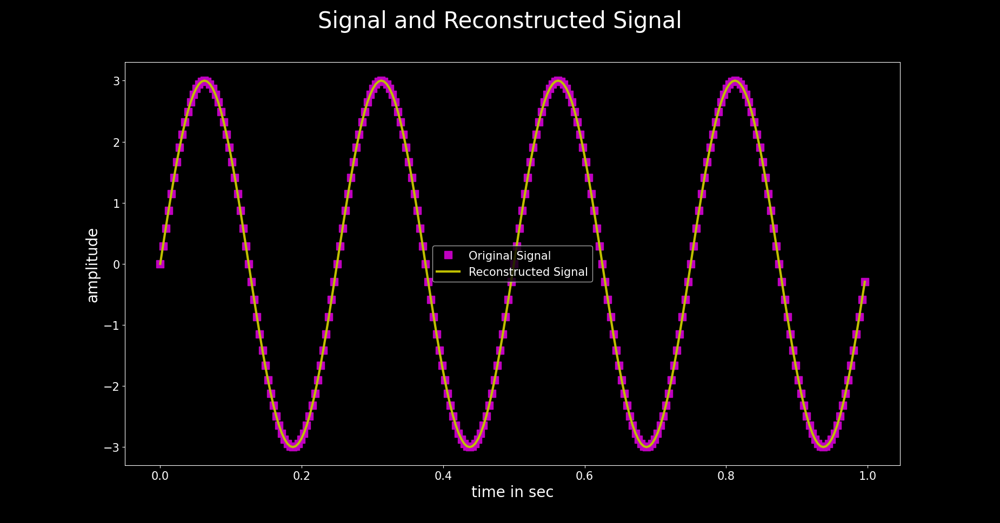

