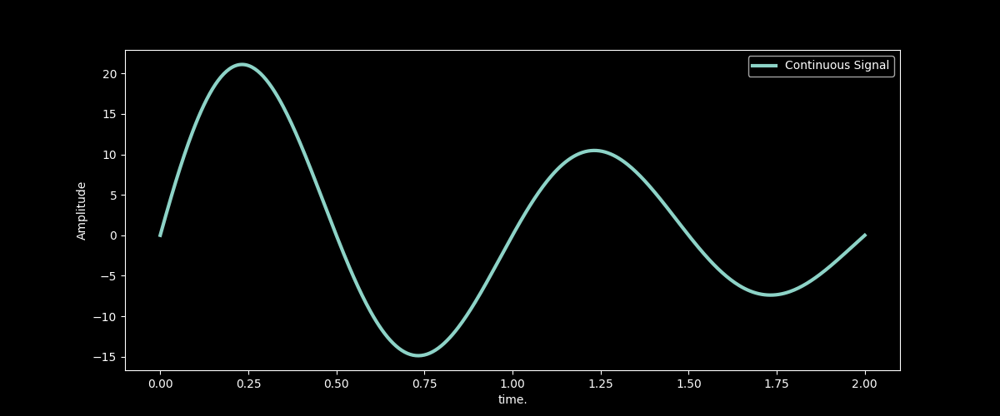
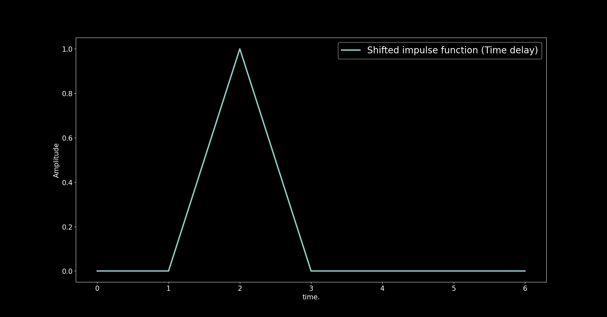
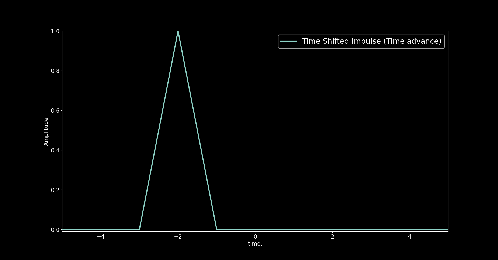
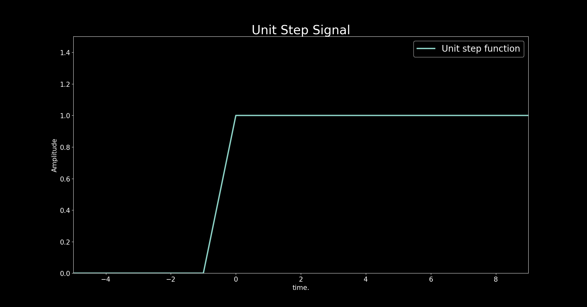
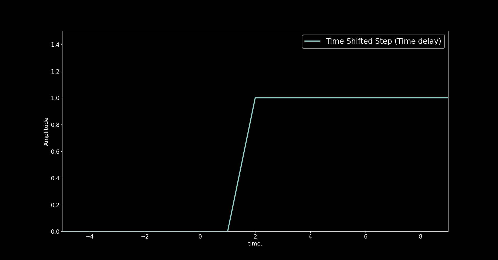
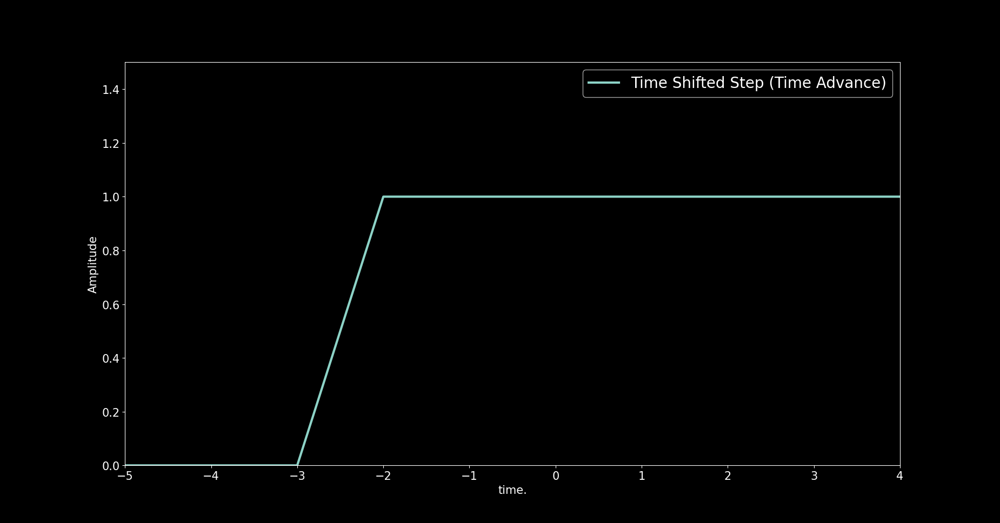
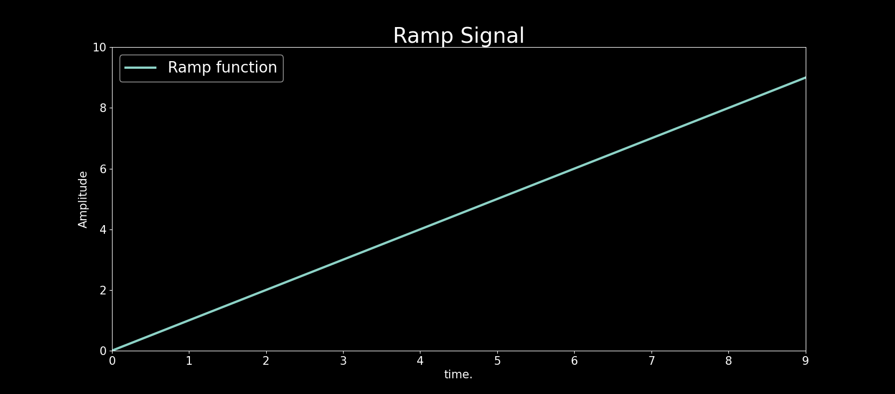
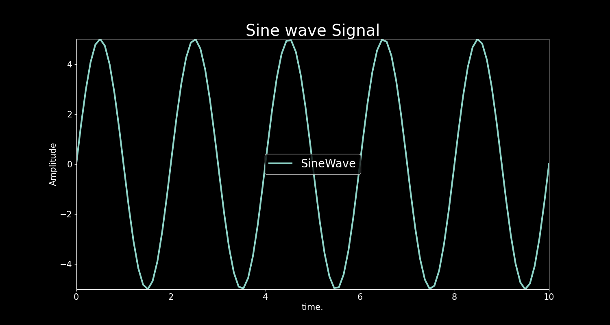

# Fundamentals of signal processing

## Signal Processing

Signal processing is the field of science which involves the manipulation of
signal to get the desired shaping, transforming a signal from time domain to
frequency and vice versa, smoothening the signal, separating the noise from
signal i.e filtering, extracting information from the signal.

Signals exist in nature are continuous signal. Continuous-time (or analog)
signals exist for the continuous interval (t1,t2). This interval (t1,t2) can
range from -inf to inf.

- [Code](plots.py)

## Basics of signal processing system

Since computer needs digital signals for processing, therefore, in order to use
an analog signal on a computer it must be digitized with an analog-to-digital
converter.Thus, there is a need for an interface between the analog signal and
the digital signal processor.

---

See: [Analog to Digital Conversion](../analog_to_digital/)

---

## Fundamental Continuous time signal

Continuous time signal has infinite range of values over the time. It is denoted
by $x(t)$. Now we will discuss some fundamental continuous time signals for positive
value of the time (t > 0).

### Unit Impulse Signal

Unit impulse signal, denoted by $\delta (t)$, is given by

$\delta (t) = 1$, for $t=0$

and

$\delta (t) = 0$, for $t \neq 0$

### Time shifted Impulse

Impulse signal is one at $t=0$, however, we can shift the signal on both sides of
zero. There are two kinds of time shifting.

1. Time delay.
2. Time advance.

### Time delay

In time delay, we move the signal towards right side of the zero i.e towards
positive time axis. If we delay the signal towards right by two units then the
equation of impulse become:

$\delta (t-2) = 1$

### Time advance

In time advance, we move the signal towards left side of the zero i.e towards
negative time axis. If we advance the signal towards left by two units then the
equation of impulse becomes:

$\delta (t+2) = 1$

### Unit Step signal

The unit step signal, denoted by $u(t)$, is described as a function having
magnitude of 1 at time equal to and greater than zero.

$u(t) = 1$, for $t \geq 0$

and

$u(t) = 0$, for $t \lt 0$

### Time Shifted Step

### Unit Ramp Signal

The ramp function is a uniformly increasing time domain signal of a constant
slope. The ramp function is described as a function having a magnitude of $t$ at
$t \geq 0$.

$x(t) = t$, for $t \geq 0$

and

$x(t) = 0$, for $t \lt 0$.

### Sinusoidal signal

A sinusoidal signal consists of an oscillations that repeat over a fixed interval of
time called time period of the signal. A sinusoidal signal for $t \gt 0$ is given by
$x(t) = Asin(2\pi ft)$

where,

$A$ = Amplitude of the signal.
$f$ = Frequency of the signal.

### Unit Exponential signal

The unit exponential function is described as has a magnitude of 1 at time zero
and exponentially decaying for time greater than zero. An exponential signal
for $t \gt 0$ is given by

$x(t) = 1$, for $t = 0$

and

$x(t) = e^{-t}$, for $t \gt 0$
