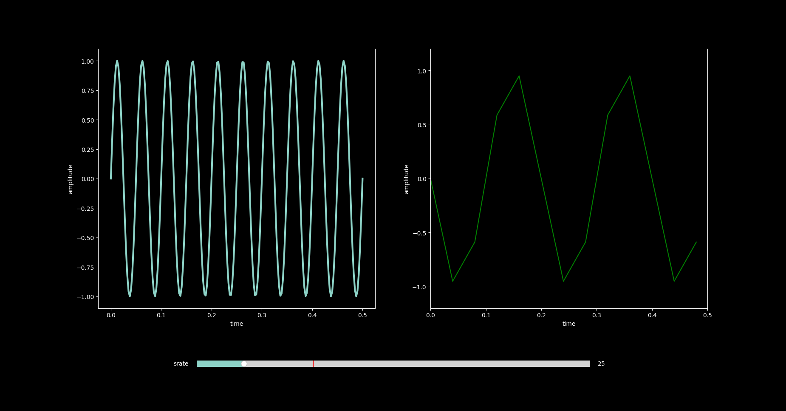
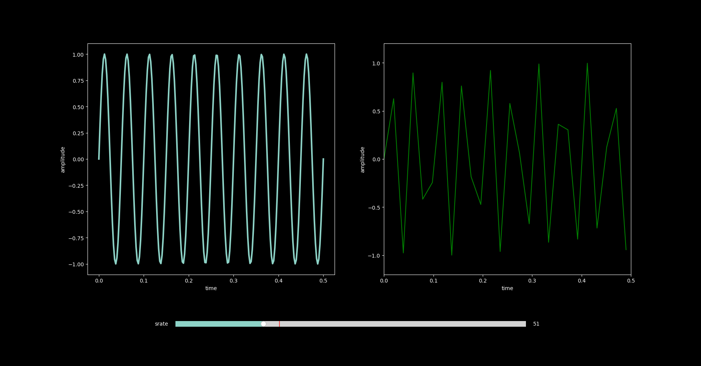
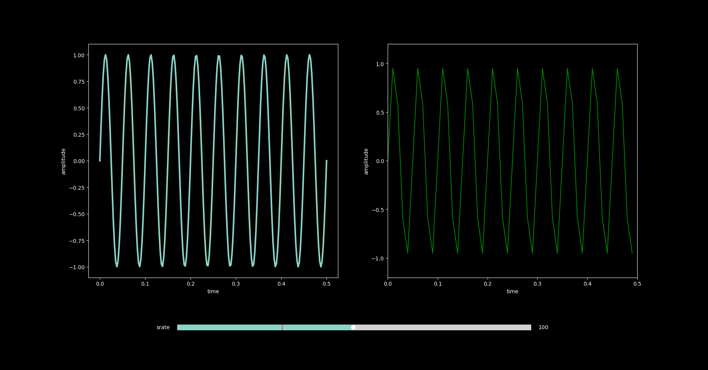
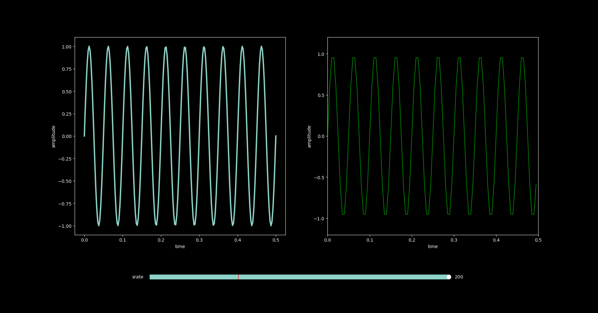

# Nyquist Theorem

The Nyquist-Shannon sampling theorem states that to perfectly reconstruct a
continuous-time signal from its samples, the sampling rate must be greater
than twice the highest frequency component present in the signal. This minimum
required sampling rate is known as the Nyquist rate. 

- [Program Nyquist](nyquist.py)

**25:**

**50:**

**100:**

**200:**

